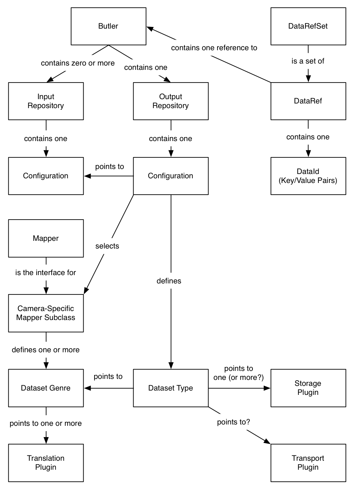

# Architecture Notes

## The Butler

The Butler is the interface between applications pipelines and the actual data.
It is the primary data access interface.  It hides any detail of how that
access is being done.

Original concepts had a Persistence object that managed Formatters that
translated between data in memory and storage represented by Storage classes.
The Butler has taken the role of that Persistence object; it takes care of and
manages all necessary processing to do persistence and retrieval of data.

The Butler is a dispatcher.  The Old Butler is a thin abstract interface over
the actual implementation, which is in a Mapper.  The New Butler should
continue to be a thin interface that also includes utilities; most of the work
should occur in objects plugged into the Butler.  The plugins for the Old
Butler were usually written into a Mapper subclass, which was limiting.  We
need a more flexible framework that allows a variety of plugins including ones
that would translate file formats into in-memory objects and translate
key/value pairs into other key/value pairs.

## Datasets

A Dataset is the persisted form of an in-memory object.  It could be a single
item, like an integer or even a boolean.  It could be a composite like a
struct; it could also be a collection or list.  The Butler does not care what
it is -- it is just a piece of data to be retrieved as a unit.  The Butler
doesn't know or care if it is a database, a table, or an image.

Every dataset has a type.  Datasets in a repository are generally intended to
be managed by the Butler, not moved or removed or added to outside the Butler.
But, as a particular case, we want to enable dynamically created datasets that
are discovered through the filesystem (by globbing).  Datasets are not
inherently versioned.  Their description could include a version.  We also need
a way of versioning repositories which could be a number or a validity time
range.

## Repositories

A Repository is a collection of datasets.  A repository currently has a
metadata database within it to help in finding datasets.  (This needs to be
extended and improved.)  The configuration for accessing datasets in a
repository (the configuration for a Mapper) is stored separately as code (or
`pex_policy` configuration that is treated like code).  In the New Butler, it
moves into the repository and travels with it and can be modified in it.

## Dataset Identifiers

Identifying a dataset in a repository is via key/value pairs that are
scientifically meaningful, in the vernacular or language of application writers
or scientist users.  For example, if a given task is applicable to images from
different cameras, the key/value pairs might be different for each camera.
When applied to LSST data, it might use visit/raft/sensor, while a different
camera might have totally different keys.

In order to do that, we need to be able to translate from those key/value pairs
to more concrete, specific key/value pairs and then translate to actual data
locations.  That is done via a series of steps.  First, keys are canonicalized
by translating alternate names to canonical ones.  This enables downstream
translations to work with known inputs.  Second, values of keys may be
validated.  Third, the list of keys required to fill out the dataset type's
template is identified.  Fourth, translation/lookup plugins are invoked in
order to compute those required keys from the available ones.

There is currently no other dataset identifier.  The old Butler translates
everything into filesystem operations.  We have mechanisms to translate into a
filename, but there is no way to pass that filename back in as a dataset
identifier.  There is the potential to have a different kind of concrete
identifier like a unique identifier (unique filenames or a UUID with a mapping
table), but this doesn't seem to offer much value over key/value pairs.  But we
could offer a key that is "uuid=".  Key/value pairs are unordered.

Values are potentially anything, but they are defined by what is appropriate
for a given dataset type.  They are not usually arbitrary types but are
specific types and values can even be validated.  Incorrect values will just
fail.

## Rendezvous

The Butler needs to be able to derive additional key/value pairs from a dataset
identifier.  The primary use is to rendezvous one dataset with another.  For
example, given an image, there are calibration datasets or reference datasets
(e.g. camera information, astrometry references) that are appropriate for
processing that image.  The rendezvous comes by translating one set of
key/value pairs to another by looking them up in a database.  If additional
metadata information is available (e.g. through iRODS or another file
management system), that database should be used instead of or in addition to
an internally-managed database.  The Butler needs to provide primitives for
doing that kind of database lookup; the Butler configuration makes use of those
primitives to associate datasets.

## Dataset Types

The dataset type is a label given to a group of datasets that reflects its
meaning or usage.  It is not the same as a Python or C++ class.  A given Python
class may correspond to multiple dataset types because it is used in a variety
of different contexts.  An Image class could be a raw image, a
partially-processed image, a calibrated image, etc., each with a different
dataset type.  The dataset type always corresponds to a particular Python class
but may have different physical representations (storage formats) in different
repositories (not usually varying in the same repository).

A given single physical representation (file, database, etc.) may correspond to
more than one dataset type and may be read into or written out from multiple
Python classes.  For example, a FITS file may have a dataset type for reading
all of its data and another one for just reading its (primary HDU) metadata.

The configuration defines what dataset types are allowed.  Putting it into the
repository allows new dataset types to be defined on the fly, in particular by
applications.  Today, in the Old Butler, this is done in the `obs_*` packages
by configurations that are not code (they are `pex_policy` files), but are
treated like code and need to be built and installed as new versions in order
to make use of them.  This also means that a new dataset type needs to be added
to *all* `obs_*` packages.

The problem then is that the configuration information still needs to be
specified.  It should not be in the application code, because then it is code
again and because it is hard to make it camera-specific there.  How can we make
camera-specific configurations that are dynamic?  We have camera-specific
templates (known as "dataset genres", since "class" is very overloaded) that
are provided by something code-like that the application can then instantiate
to create a new dataset type within that genre.

## DataRefs

A DataRef is a data identifier plus a Butler.  The idea behind it is that a
DataRef could be applied to multiple dataset types as long as the keys are
appropriate.  The application writer has to know that this is the case.  A set
of DataRefs can be used to access collections of data.

## Mappers

The Mapper should not be used by application code directly.  Currently, that
wall has been breached in places.  The Mapper should be driven by the
per-repository configuration.  We should be able to have a generic mapper that
takes a configuration that specifies the plugins (that are code) to be used, so
that all that code does not have to be in the Mapper subclass.  The purpose of
the Mapper is to do the translation between key/value pairs and derived
key/value pairs and then map between derived key/value pairs and a mechanism
for accessing the data.  The mechanism for accessing the data can be
partitioned into a physical representation (format) and a transport mechanism.

We could have different ways of getting to data: a filesystem and files within
it.  The Old Butler restricted a repository to a single root directory that it
owned and could do anything within.  Then there are physical representations of
datasets within that.

Another type of repository might be a database.  Instead of a pathname, you
would have the database connection information, database name, table name or
set of table names if a join is required, and a `WHERE` clause.  The Mapper
would have to translate the data identifier into those concrete items.

## Transport

A filesystem can be accessed directly through filesystem operations or remotely
via HTTP or WebDAV.  Originally, it seemed like it would be good to separate
the concrete location of something from how to retrieve it.  This would be
implemented by using URLs that would have a substitutable transport "scheme"
along with a common concrete location "path".  But that might not be necessary;
accessing something through iRODS or HTTP could look just like a different way
of storing the data.  Transport would then be embedded into different concrete
storage mechanisms.

It would be useful to extend the Butler over a network.  All Butler operations
could be transmitted to a Butler proxy service (the "Remote Butler Interface")
that would then do all data retrieval and send the data back.  This last data
transmission could be tricky since the Butler is defined to retrieve data to
memory.  If the Remote Butler Interface is using the Butler, then it has data
in memory that would have to be serialized for transmission.  Instead, it might
be better for the Remote Butler Interface to transmit the persisted form of the
data to the client side (which it would obtain by using the Mapper internals);
the local Butler would then execute the necessary code.  This is akin to a
staging service, as the data would likely need to be persisted on the local
end.  There could be performance implications as a result.

## Aliases

We want to write code that is not only not specific to a given camera but not
even specific to a given dataset type.  If you are processing certain images,
it does not matter how you got that image.  For example, there are many
different types of coadd images that were generated in different ways and so
are different dataset types, but the downstream processing could apply to any
of them.  You can thus define an alias at the command line processing level of
your application and have the underlying algorithms all use the alias and not
worry about what dataset type it actually corresponds to.

## Input and Output Repositories and Their Configurations

A Butler manages a repository.  The New Butler manages the output repository
that an application is going to create datasets in.  If an application does not
create any new datasets but is only generating logs or ingesting into a
database (for now) or other non-Butler side effects, the output repository is
just a location for configuration information, metadata, and provenance.  A
Butler can have multiple input repositories.  We want to link repositories into
a hierarchy or network.  An application takes inputs from many places.  Rather
than copy them into the output repository, we specify where they are and access
them from there.  The Old Butler creates a symlink from the input repository to
the output repository and used it in such a way that it looked like all the
contents of the input repository were contained in the output repository.  That
was very convenient and very useful.  The New Butler will not use a symlink but
will do this by searching through the input repositories (which are recorded in
the output repository configuration) in the order in which they were specified.

With configuration defined on the fly, what happens if someone creates a new
dataset while you are reading from the repository?  An application can create
new dataset types but cannot change the configuration of existing dataset
types.  That would be an administrative operation.  The configuration is then
append-only.

We have many parallel instances of an application running at a given time,
starting up at slightly different times, usually writing to a single output
repository.  (We could have each instance write to its own output repository
and then combine them all at the end, logically or physically, but that is more
complex and is not the way we have been doing things.)  Creating a new dataset
type in the output repository requires updating the configuration only once,
and all instances must agree what was written.  There are other dataset types
that we were writing with the Old Butler that have the same idea: algorithm
configuration information, table schema information.  The Old Butler looks to
see if the file exists and reads it in and compares it if it does to make sure
it has the same contents, with some locking around creating the file if it does
not exist.  This may put a severe load on distributed filesystems, so other
mechanisms were investigated.  A SQLite database was a possible alternative
that might be more robust than using filesystem locking with individual files.
The hope was that SQLite transactional locking would work better than custom
code.  The repository already had a SQLite database for metadata used to
translate key/value pairs, so why not reuse it?  But doing this in file space
is still a potential alternative.

Users will be able to use a raw filesystem via globbing as an input repository,
but that will limit the kinds of things that can be done.  The user will need
to provide key/value pairs that are closer to the contents of filesystem
pathnames because there is no other way to map.  Doing calibration rendezvous
will almost certainly require a database on at least the calibration
repository.

An output repository will almost certainly need to have a SQLite database
within it for dataset existence information and provenance.  But a downstream
user would not be required to use the SQLite database for anything if it
understood the repository format.

## Configuration Representation

Attempts were made to store configuration in files or in a database table with
a well-defined schema.  But users should be able to easily create new
configurations or modify an existing one.  A database table would require a
tool to do that editing.  So the current code has a YAML string stored in the
database that could be edited externally and then loaded back into the
database, or, if this is an initial configuration, the YAML string could be
provided in an independent file that would then be loaded into the database.
This is not a really great solution.  Perhaps the best solution is to go back
to configuration files with filesystem-based locking.  Each dataset type would
likely be in its own file (or its own table) so that applications that are
creating different dataset types do not interfere with each other.

## Flexibility versus Strict Checking

The Genre is generally expected to have the dataset type in its location
template so that two dataset types could not collide.  But there is no
technical limitation that would prevent collision.

We could have a very generic, flexible, system that relies on policy and proper
usage to avoid problems, or we could have a strictly-defined system that
prevents problems from occurring.  The Old Butler has a quite generic system
that has been instantiated in a particular way (the CameraMapper subclass) and
hence helps prevent some problems but that could still be overridden if
necessary.  We could say that we own output repositories and can strictly
define what they look like, but input repositories would be more general.  But
this is likely to be overly constraining for people outside the LSST world
unless we choose a lowest-common-denominator output repository format that
might then constrain our own production.

One expressed requirement is that we be able to write to the current directory
in which a Task is executing in order to generate a particular user-specified
output filename.  (It is less clear what should happen if a Task has multiple
outputs, including automatically-generated outputs like processing metadata and
provenance information.)  We also need to make sure that we can read input
datasets from existing directory trees.

Should pluggability be at the dataset type level?  Each dataset type is defined
as a combination of the application instantiation and the underlying Butler
configuration that defines the available Genres and their provided base
configurations.

The overall configuration might be: filesystem to filesystem for a given
camera, or filesystem-plus-database to filesystem-plus-database.  Where we
draw the lines between the Genre, the instantiation by the application, and
the end user is the tricky part.  The Genre configuration is about outputs.
The input repository configuration is defined by however it was created.
The user just needs to be able to point to the input repository -- or its
configuration.  What is changeable on a dataset-type-by-dataset-type basis
is defined by what the Genre allows you to change.

We could have a variety of monolithic code-driven Mappers (that users could
subclass and rewrite) rather than a configuration-driven system.  The current
New Butler design of a framework with plugins should be more extensible and
useful in the long run.  There are already examples of many different ways that
people want to store data.  A single repository might need to refer to all of
those ways.

Let us say you want to read data from local, some calibrations from local, the
rest of the calibrations from a remote location.  That would be done by having
a chain of repositories -- the local calibrations would have their own mapper
configuration that points to the local filesystem, but the same dataset types
in the remote repository would have their own mapper configuration that could
be quite different (but would be effectively overridden because the local input
repository would be searched before the remote one).

Will we have one mapper configuration per dataset type per repository or will
we only have one mapper configuration per repository?  In the latter case, we
might have to have multiple output repositories.  It does not really matter
much; the same information needs to be present either way.  We could share
configuration information within a single repository; that is expected to be
handled by the Genre.  The Genre is expected to contain the Python type so that
all images, for example, might be handled by the same Genre separate from FITS
tables.

Instead of pluggable Genres brought into a repository by the repository
configuration, we could have more hard-coded Genre equivalents that are in a
monolithic Mapper, the name of which is the sole repository configuration.

The application should not be able to specify any part of the concrete location
of an output dataset type.  It would specify particular data identifier keys
that would be required (which might come from an input data identifier).

The current `daf_butler` code is just the beginning of the framework.  There
are many plugins that will be needed.

## Composite Datasets and ORM

The next level of complexity is the idea of composite datasets.  A dataset can
be accessed as an entire dataset, but you can also access parts of it.  These
are different dataset types because they have different Python types and may
use different reading mechanisms.  But when writing composites, we sometimes
want references to other datasets rather than duplicating them.  For example,
we may want each Source to have a reference to a PSF model.  This is ORM-ish.
The Old Butler insisted on avoiding this, but this led to data duplication.
Can the New Butler provide primitives that can enable this?  The "write-once,
ensure equal" mechanism for configuration information might be used.  The PSF
model might have been written out previously by another application in another
repository.  We could provide a unique key and require the application to
do a separate retrieval.

The Butler should not have to look into the Source and know that it has a PSF
model pointer that has to be managed.  Instead, the Butler should pass the
Source to a SourceWriter plugin.  That SourceWriter would understand the
composition of a Source and know that it has a PSF model pointer.  It could
then call back to the Butler to determine whether that pointer has been
persisted (or retrieved).  The Butler has to maintain a list of things
retrieved and persisted; this could be a dictionary with references to objects.
For Python objects, this could be maintained in a hidden Butler-implementation
field in the object, but something like an int could not be handled this way.
But it is not the responsibility of the Butler to do all ORM.

## Provenance

The Butler should record all datasets that a task retrieves and persists; in
particular, it should record everything that has been retrieved up to the point
that an object is persisted (as that is the maximum relevant set for
provenance).

## Perceived problems with the Old Butler

* the need to update Policies to create new datasets
* difficulty defining new storages
* inability to query databases
* inability to alias dataset types
* no real support for raw filesystem with pathname templates using globs (instead of iterating through the registry database)
* inability to update registry database as datasets are created

## Plugins, Genres, and Camera-Specific Mapper Subclasses

Plugin code should be able to be located in any package.  Storage plugins
should be able to be a free function or a method in a class, whether a storage
class or the class of the Python type.

We need camera-specific plugins to translate key/value pairs into other ones;
these would need to be able to look up databases, among other things.  They
would be configured into the Butler by the camera-specific configuration.  The
Butler or Mapper should also provide convenience functions to do the most
common kinds of lookups (e.g. in SQLite databases).  The translation plugins
could be invoked using an automated goal-seeking path discovery algorithm, but
that seems complex.  So it is more likely that each camera would have its own
code; this does not have to be configurable.

The Butler configuration would specify a camera-specific class; that would
contain Genres applicable to that camera and the Mapper information specific to
that camera.  This is not that different from the CameraMapper subclasses in
the Old Butler.

Should there be a transport plugin different from the storage representation of
the data?  That would allow for staging, but staging could perhaps be
completely outside the Butler in the orchestration middleware layer.

Retrieval of data from tape would usually be at the middleware layer.  It would
sequence the production and retrieve data from tape before it is needed.  It
could also stage data to local disk for execution of a task.  On-demand
staging from slow systems does not work well.

We need to enable storage to be in object stores or similar systems like S3 or
iRODS, filesystems, and databases.  This could be handled on a per-Python-class
level, but it seems that there should be a way to factor the underlying storage
out.  Files and databases would be quite different from each other; object
stores might have to be slightly different from files.

The Genre specifies the code method used to read and write; if `None`, then
there is no way to read (or write).  The application intentionally cannot
change this.  The per-repository configuration also should not be changed for
input repositories.  Output repositories can be configured with new Genres.

There is an issue about versioning of Genres and code for old repositories.  We
expect Genres and storage plugins to be backward-compatible, but that may not
always be able to be maintained.  But it may be difficult to run old storage
plugins.  This will require some thought.

The application does not currently have a strict guarantee of the Python data
type that is returned for a given dataset type from a given repository, but it
should not change.  As long as camera-specific code is expected to inherit
common Genres (which specify Python data types) and use them for common dataset
types, a single Python type per dataset type would naturally fall out.  But we
could enforce this in the code, even to the point of making the Python type
part of the dataset type name.

The dataset type corresponds to one storage type in a given repository but not
necessarily in different repositories.  When you configure an output
repository, you can configure the kind of storage you want to use with each
dataset type.  The default should be a camera-specific thing, but the user
should be able to override this.

The output repository should use the camera information from the input
repository if present.  But we could have multiple input repositories from
different cameras, so we may need to choose a default or use a user-specified
camera.  Some output dataset types might have configuration information that
would not be camera-specific.

The camera specifies a set of Genres as a default.  The user should be able to
include other Genres as well (but they would still be specified in code).

# Butler Interface

The New Butler interface includes a way to create a Butler, specify the
repository or repositories that it is managing, get a dataset, put a dataset,
understand what keys are appropriate for a given dataset type, get all dataset
types we know about, create a new dataset type, get a set of references to
datasets that exist for a given dataset type with a partial data identifier
(iterate through the datasets in a given repository), and define an alias for
part of a dataset type name.

# Design issues

## Relevant Trac tickets:

* \#2887, unpersist a subclass of a config
* \#2425, provide better error messages if a data item does not exist
* \#3114, iterate through available values for a key
* \#3050, allow hashes in paths
* \#3038, optimize registry loading
* \#3037, return Exposure
* \#3036, look up calibrations without visit ids (should be by valid date or something similar)

# Internal Components

## Mapper

    Not used by application code; only used via Butler
    Driven by per-repository configuration
    Camera-specific subclasses recorded in repository configuration
    Obtains a location template based on dataset type
        Inherits from dataset class
        Includes URL path with transport, storage method, optionally Python type
        Includes filesystem locations and database tables/queries
        Read-only and write-only types
    Expands an input DataId with additional key/value pairs (fixed and/or as-needed) needed to expand location template
        Queries registry databases in input repositories as needed
        Globs in filesystem if needed
    Expands location template into a ButlerLocation
    Optionally can provide methods for standardizing (post-processing) retrieved data
    Can be used to bidirectionally map DataIds to numeric identifiers
        By treating numeric identifier as a dataset or as a single DataId key\'s value
        Uses special IdStorage

    Provides utilities for subclasses

        Maintain templates for dataset types in repository configuration

        Look up key/value pairs using equality or range joins in registry databases

        Glob for key/value pairs in filesystem

        Record metadata of new datasets in registries

        Maintain registry of registries

## ButlerLocation

    All location information needed for a Storage
    May include:
        Expanded path template(s)
        Python object class name
        Storage class name
        DataId
        Additional key/value pairs

## Butler

    Obtains mapper class name from repository
    Calls Mapper to translate DataId into location
    Calls appropriate Storage to retrieve or persist data
    Repository identified by root (URL) path
